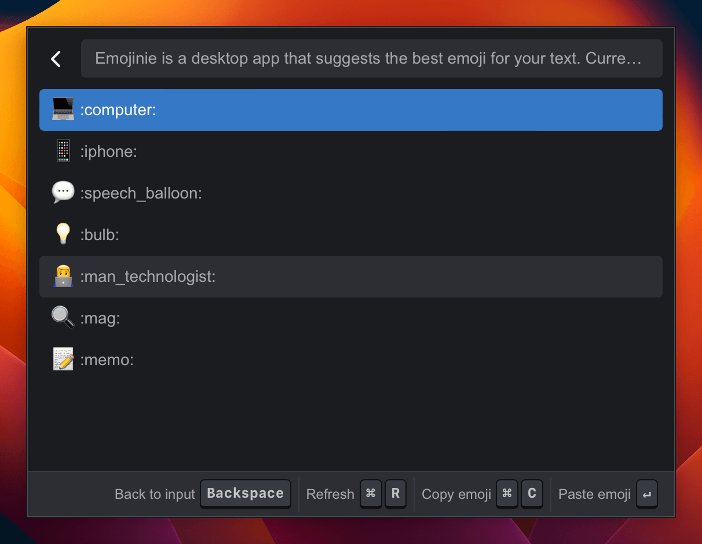

<p align="center">
  
</p>
<h1 align="center">Emojinie</h1>
<h3 align="center">Find the best emoji for your text</h3>

Emojinie is a desktop app that suggests the best emoji for your text.
Currently only supports macOS.

<p align="center">
  
</p>

## Installation

### macOS

1. Go to the [Latest Release](https://github.com/kohii/emojinie/releases/latest) page and download the corresponding chip's .dmg installation package.
2. Double click the downloaded file to install it.
3. Ready to use!

#### If you cannot open the app because of the developer cannot be verified

<p align="center">
  
</p>

1. Open `System Settings` app and go to `Security & Privacy`.
2. Click `Open Anyway` button.

If you cannot find the `Open Anyway` button, follow the steps below.

1. Open the Terminal app.
2. Run the following command.

```bash
xattr -r -d com.apple.quarantine /Applications/Emojinie.app
```

#### If you cannot open the app because it is damaged

<p align="center">
  
</p>

1. Open the Terminal app.
2. Run the following command.

```bash
xattr -r -d com.apple.quarantine /Applications/Emojinie.app
```

#### If you cannot paste the emoji to other apps

1. Open `System Settings` app and go to `Security & Privacy`.
2. Click `Accessibility`.
3. Click `+` button and add `Emojinie` app.
    - If `Emojinie` is already in the list, remove it and add it again.
4. Ensure that `Emojinie` is checked.

### Windows

Currently not supported.

## Development

### Prerequisites

- [Rust](https://tauri.app/v1/guides/getting-started/prerequisites)
- [pnpm](https://pnpm.io/installation)

### Recommended IDE Setup

- [VS Code](https://code.visualstudio.com/) + [Tauri](https://marketplace.visualstudio.com/items?itemName=tauri-apps.tauri-vscode) + [rust-analyzer](https://marketplace.visualstudio.com/items?itemName=rust-lang.rust-analyzer)

### Start Development

```bash
pnpm tauri dev
```

## Build

```bash
pnpm tauri build
```
